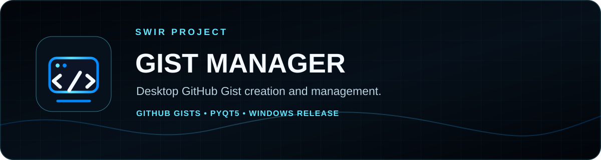
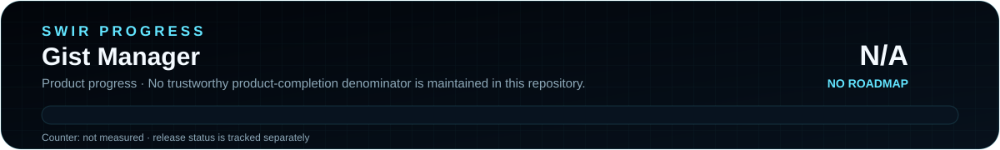

<!-- SWIR-README-STANDARD:v2 -->

<div align="center">



# Gist Manager 2.0

**Create, search, open, copy and delete GitHub Gists from a focused PyQt5 desktop interface.**


[](https://github.com/Swir)
[](https://github.com/Swir/Gist_manager/stargazers)

[**Highlights**](#-highlights) · [**Quick Start**](#-quick-start) · [**Token safety**](#-github-token-and-local-storage) · [**Releases**](#-releases)

</div>


## 📍 Project Status

<p align="center">
  
</p>

| Item | Status |
|---|---|
| Current stage | Maintained 2.0 desktop utility |
| GUI | PyQt5 |
| Published package | Windows [`v2.0.0`](https://github.com/Swir/Gist_manager/releases/tag/v2.0.0) |
| Main API | GitHub Gists API |
| Product progress | **N/A** — no authoritative product-completion roadmap is maintained |
| Local settings | QSettings compatibility retained from the earlier app |

<p align="center">
  
</p>

The SVG progress assets intentionally show **N/A**, not 0%, because there is no trustworthy product-roadmap denominator in this repository. Release status is tracked independently.

## 🚀 Overview

**Gist Manager** is a lightweight desktop client for creating and managing GitHub Gists without repeatedly switching to the browser. Version 2.0 keeps the original simple workflow while providing a reorganized interface, search, context actions, multiple themes and a Windows one-file distribution.

## ✨ Highlights

| Feature | What it does |
|---|---|
| 📄 File → Gist | Create a Gist from a selected UTF-8 text file. |
| 📁 Folder mode | Walk a selected folder and create Gists from its files. |
| 🖱️ Drag & drop | Drop a file or folder onto the Create workspace. |
| 🔎 Gist search | Filter loaded Gists by description, URL, file or ID. |
| 📋 Copy / open | Copy normal/raw URLs or open a Gist in the browser. |
| 🗑️ Delete | Delete selected Gists after confirmation with progress feedback. |
| 🎨 Themes | Midnight Blue, Graphite and Light. |
| 🖥️ Desktop UX | High-DPI handling plus remembered window size/position. |
| 📦 Windows release | Standalone EXE, portable ZIP and SHA256SUMS asset. |

## ⚙️ Quick Start

### Recommended — Windows release

Download **`GistManager.exe`** or **`GistManager-v2.0.0-Windows.zip`** from [release v2.0.0](https://github.com/Swir/Gist_manager/releases/tag/v2.0.0). The release also includes `SHA256SUMS.txt`.

### From source

```bash
git clone https://github.com/Swir/Gist_manager.git
cd Gist_manager
python -m pip install -r requirements.txt
python GistApp.py
```

Dependencies are currently:

```text
PyQt5>=5.15,<6
requests>=2.31,<3
```

## 📋 Requirements / Compatibility

| Component | Scope |
|---|---|
| Python source | Python 3 with a PyQt5-compatible environment |
| GUI | PyQt5 |
| HTTP client | requests |
| Account access | GitHub token with permission to work with Gists |
| Published binary | Windows v2.0.0 |
| Other desktop OSes | Source may run where dependencies are available; no packaged Linux/macOS release is claimed here |

## 🔐 GitHub Token and Local Storage

The application requires a GitHub token with permission to access the Gists you want to manage. The token field uses password-style input and the application preserves its earlier local `QSettings` storage identifiers for compatibility.

Treat the token like a password:

- grant only permissions you actually need;
- do not paste it into issues, screenshots or logs;
- revoke and replace it if it is exposed;
- remember that local reusable settings are only as private as the user account and machine that store them.

The README does not claim OS keychain or encrypted credential-vault storage.

## 🎮 Main Workflow

1. Start `GistManager.exe` or run `python GistApp.py`.
2. Provide a suitable GitHub token.
3. Create Gists from a selected file, folder or drag-and-drop input.
4. Load and search your existing Gists.
5. Use copy/open actions or delete selected Gists after confirmation.
6. Choose one of the available interface themes in Settings.

## 🧠 Technology / Architecture

| Layer | Technology / role |
|---|---|
| Entry point | `GistApp.py` |
| GUI shell | `gist_manager/window.py` |
| Create workflow | `gist_manager/creator.py` |
| Manage workflow | `gist_manager/manager.py` |
| GitHub API | `gist_manager/api.py` |
| Configuration | `gist_manager/config.py` |
| Styling | `gist_manager/style.py` |
| Packaging | PyInstaller through GitHub Actions |

## 🗺️ Roadmap / Progress

There is currently **no authoritative product roadmap** with a reproducible completion denominator. The SWIR progress graphic therefore reports **N/A** instead of inventing an overall percentage.

Future improvements should first be recorded in a real roadmap if the project resumes milestone-based development.

## 📦 Releases

The current release is **[Gist Manager v2.0.0](https://github.com/Swir/Gist_manager/releases/tag/v2.0.0)**, published on September 16, 2026. Its release assets include:

- `GistManager.exe`;
- `GistManager-v2.0.0-Windows.zip`;
- `SHA256SUMS.txt`.

Historical releases remain available in [GitHub Releases](https://github.com/Swir/Gist_manager/releases).

## ⚠️ Limitations / Security Notes

- A valid GitHub token is required for authenticated Gist operations.
- Token reuse is implemented with local Qt settings; do not treat that as a hardware-backed secret vault.
- Folder mode should be used only for files you intend to publish as Gists; review sensitive files before creation.
- GitHub API permissions and service availability remain external dependencies.
- The N/A progress graphic is not a quality score, security score or release-readiness percentage.

## 🧩 Project Structure

```text
Gist_manager/
├── GistApp.py
├── requirements.txt
├── assets/
│   ├── gist-manager.svg
│   └── readme/
├── gist_manager/
│   ├── api.py
│   ├── config.py
│   ├── creator.py
│   ├── manager.py
│   ├── style.py
│   └── window.py
├── tools/
│   ├── build_icon.py
│   └── generate_readme_progress.py
└── .github/workflows/
```

## 🔎 Search Keywords

`github gist manager` • `gist gui python` • `github gist desktop app` • `python github api gui` • `gist creator python` • `manage github gists` • `pyqt5 github tool` • `Windows Gist manager` • `desktop Gist creator` • `GitHub Gist search` • `PyQt5 Gist client` • `Gist URL copy tool`


<div align="center">


### `CREATE • SEARCH • COPY • MANAGE`

**Gist Manager — by Swir**

[**← SWIR profile**](https://github.com/Swir) · [**All projects →**](https://github.com/Swir?tab=repositories) · [**Releases**](https://github.com/Swir/Gist_manager/releases)

</div>
